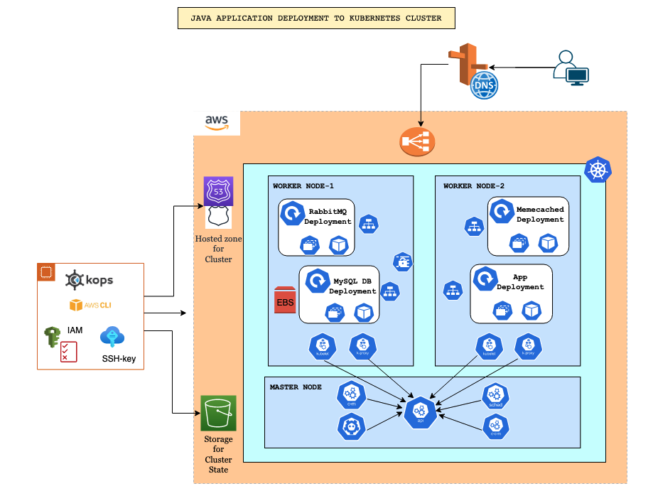
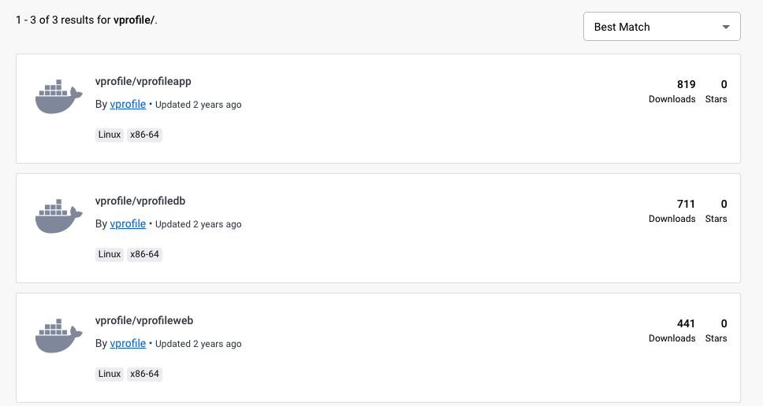
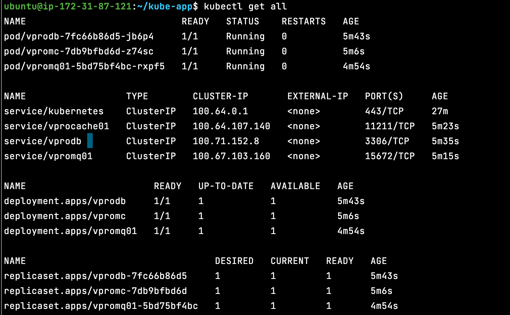

# Project-14: Java App Deployment on Kubernetes Cluster

[*Project Source*](https://www.udemy.com/course/devopsprojects/?src=sac&kw=devops+projects)



## Pre-requisites

* AWS account
* Registered DNS name

_Note: Instance sizes that will be used for this project will not be under Free-Tier._

### Step-1: Create an EC2 instance 

We will launch an Ec2 to install kOps with below properties.
```sh
Name: kops
AMI: Ubuntu 20.04
InstanceType: t2.micro
SecGrp: allow SSH on port 22 from MyIP
KeyPair: create a new keypair
```

### Step-2: Create S3 bucket

We will create an S3 bucket to store Kops state. As long as we point our s3 bucket with kops state file, we can run kops command from anywhere.

```sh
Name: kubeapp-kops-state
```

### Step-3: Create IAM user

This user will be used for AWSCLI Programmatic access.

Name: kopsadmin
Policy: AdministratorAccess (you can specifiy only necessary permissions as well for best-practice)
- [x] Programmatic Access


### Step-4: Create Route53 HostedZone

We will create a Public hosted in Route53. Then we will add its `NS` records to our Domain registerer.
My registered domain name: `aws-devops-journey-of-shubhampandey.net`. I will create a hostedzone with below name. 

```sh
Name: kubeapp.aws-devops-journey-of-shubhampandey.net
```

Then we will create 4 NS values to our Registered domain as `NS Record`.

### Step-5: Login Ec2 and configure awscli

SSH into your kops instance with your newly created pem key.

First we will create an SSH-key which will be used for kops. Public key will be pushed to all other instances automatically.
```sh
ssh-keygen
```

Next we will install awscli and configure it with `kopsadmin` access credentials.
```sh
sudo apt update && sudo apt install awscli -y
aws configure
```

### Step-6: Setup kOps Cluster

As per Kubernetes official documentation, we need to install `kubectl` and `kops`. Follow steps from [documentation](https://kubernetes.io/docs/setup/production-environment/tools/kops/).Once installation steps are complete, run below commands to check if they are ready to use.

```sh
kops version
kubectl version --client
```

Next we  need to verify domain we have created in Route53.


Now we will run kops command which will create kops cluster.(_Note: Don't forget to replace your domain name and s3 bucket name in the command._) Below command won't create cluster, it will create configuration of cluster.
```sh
kops create cluster --name=kubeapp.aws-devops-journey-of-shubhampandey.net \
--state=s3://kubeapp-kops-state --zones=us-east-1a,us-east-1b \
--node-count=1 --node-size=t3.small --master-size=t3.medium \
--dns-zone=kubeapp.aws-devops-journey-of-shubhampandey.net \
--node-volume-size=8 --master-volume-size=8
```


We can create cluster with below command, we need to specify the s3 bucket we use for state config.

```sh
kops update cluster --name kubeapp.aws-devops-journey-of-shubhampandey.net --state=s3://kubeapp-kops-state --yes --admin
```

After issuing thsi command, wait 10-15 minutes before validating the cluster with below command:
```sh
kops validate cluster --state=s3://kubeapp-kops-state
```

### Step-7: Create Volume for DB Pod

We need to create an EBS volume to store mySQL data. Use below command to create one.
```sh
aws ec2 create-volume \
    --availability-zone us-east-1a \
    --volume-type gp2 \
    --size 3 \
    --tag-specifications 'ResourceType=volume,Tags=[{Key=KubernetesCluster,Value=kubeapp.aws-devops-journey-of-shubhampandey.net}]'
```


Next, I will label the nodes with `zone=us-east-1a` and `zone=us-east-1b` accordingly. We need to make sure that we are running our DB pod in the same zone our EBS volume created.
For this reason we will create labels for our nodes. 


### Step-8: Source Code Review

You can find all kubernetes manifest files by cloning this repository.Clone this repo to your ec2. Make necessary changes in files, before applying `kubectl` commands.
```sh
https://github.com/pandeyshubham03/kube-app.git
```

In Project-12, we have Containerized the vprofile application and push it to the DockerHub. We will use the images below with :V1 tag from DockerHub repository in our K8s manifests.



Our vprofile application is using below `application.properties` file. We need to create Kubernetes services with the same name given in this file for application to connect them.
```sh
#JDBC Configutation for Database Connection
jdbc.driverClassName=com.mysql.jdbc.Driver
jdbc.url=jdbc:mysql://vprodb:3306/accounts?useUnicode=true&characterEncoding=UTF-8&zeroDateTimeBehavior=convertToNull
jdbc.username=root
jdbc.password=vprodbpass

#Memcached Configuration For Active and StandBy Host
#For Active Host
memcached.active.host=vprocache01
memcached.active.port=11211
#For StandBy Host
memcached.standBy.host=vprocache02
memcached.standBy.port=11211

#RabbitMq Configuration
rabbitmq.address=vpromq01
rabbitmq.port=15672
rabbitmq.username=guest
rabbitmq.password=guest

#Elasticesearch Configuration
elasticsearch.host =vprosearch01
elasticsearch.port =9300
elasticsearch.cluster=vprofile
elasticsearch.node=vprofilenode
```

### Step-9: Kube secret for passwords

In application.properties file, we have db password and rabbitMQ password. We will encode these values and create a K8s secret file as in given under `kubernetes` directory.


### Step-10: DB Deployment&Service Definition

Create a K8s DB deployment and service file as in given under `kubernetes` directory.


### Step-11: Memcached Deployment&Service Definition

Create a K8s MC deployment and ClusterIP type service file as in given under `kubernetes` directory.Run below commands to create files:
```sh
kubectl apply -f mcdep.yml
kubectl apply -f mc-CIP.yml
```

### Step-11: RabbitMQ Deployment&Service Definition

Create a K8s RMQ deployment and ClusterIP type service file as in given under `kubernetes` directory.Run below commands to create files:
```sh
kubectl apply -f rmq-dep.yml
kubectl apply -f rmq-CIP.yml
```

We can check the resources created with below command:
```sh
kubectl get all
```



### Step-12: Application Deployment&Service Definition

Create a K8s Application deployment and LoadBalancer type service file as in given under `kubernetes` directory. Run below commands to create files:
```sh
kubectl apply -f vproapp-dep.yml
kubectl apply -f vproapp-svc.yml
```

### Step-13: Create Route53 Record for Application LoadBalancer

We will create a A record with Alias to Load balancer.

Lets validate our application from browser with our new dns name.

We validated DB by successfully logging in with admin_vp/admin_vp username&pwd.

We can validate RabbitMQ service.

Lastly, we can verify our memcached service.

### Step-14: Cleanup 

We will start with deleting our kubernetes services first. Then we will delete our cluster, s3 bucket, Route53 Hosted zone.
```sh
kops delete cluster --name=kubeapp.aws-devops-journey-of-shubhampandey.net \
--state=s3://kubeapp-kops-state --yes
```


